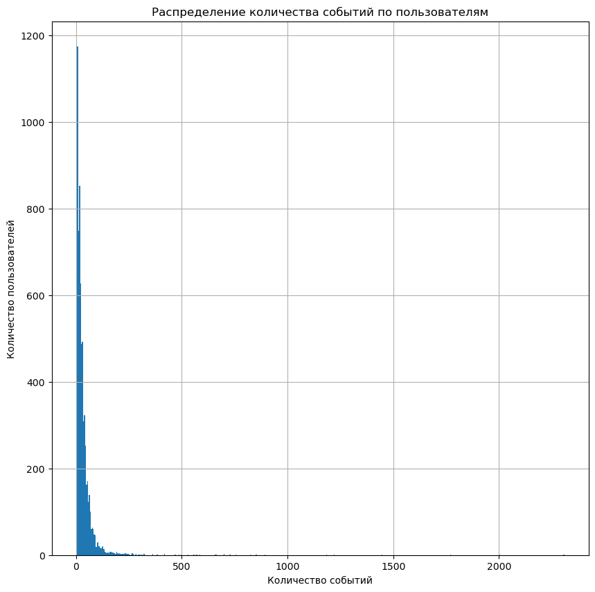
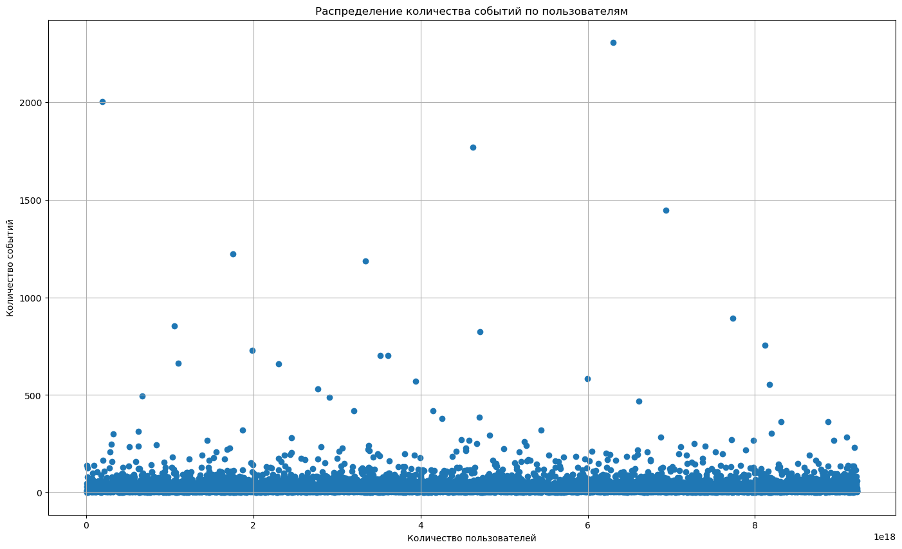
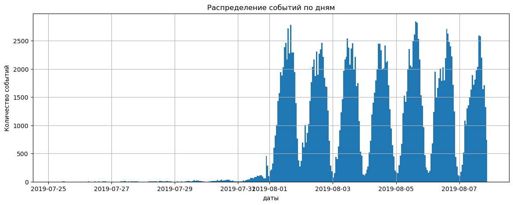
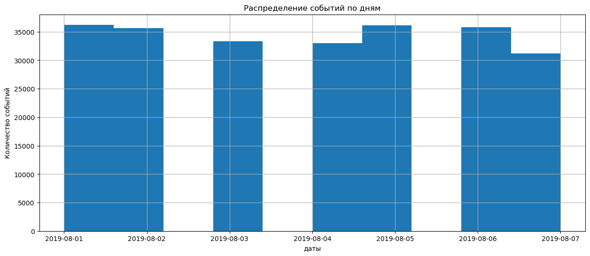
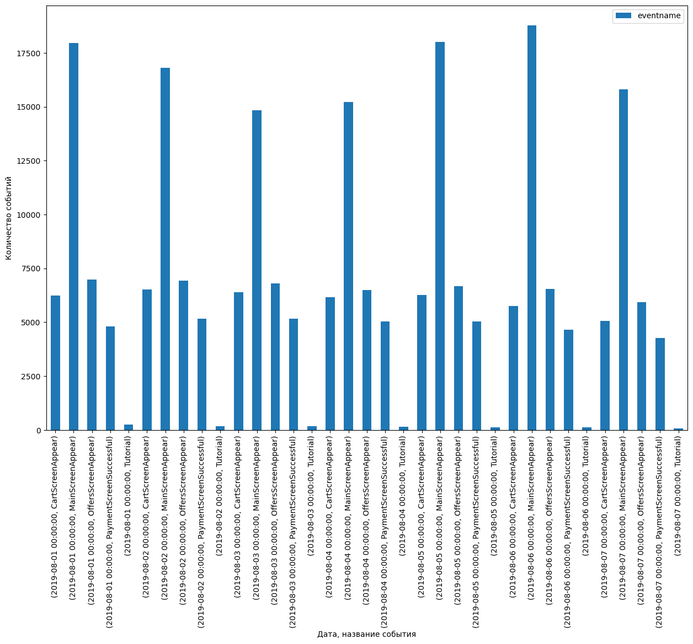
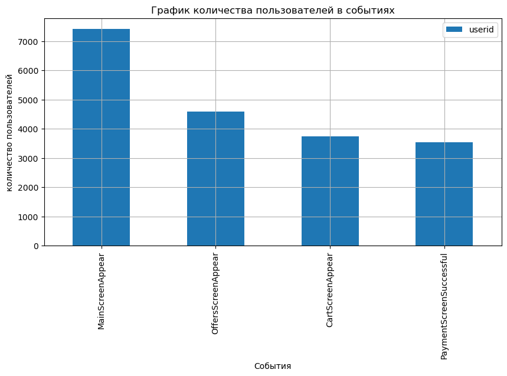

<h1>Оглавление<span class="tocSkip"></span></h1>
<div class="toc"><ul class="toc-item"><li><span><a href="#Введение" data-toc-modified-id="Введение-1"><span class="toc-item-num">1&nbsp;&nbsp;</span>Введение</a></span></li><li><span><a href="#Открытие-и-изучение-данных" data-toc-modified-id="Открытие-и-изучение-данных-2"><span class="toc-item-num">2&nbsp;&nbsp;</span>Открытие и изучение данных</a></span><ul class="toc-item"><li><ul class="toc-item"><li><span><a href="#Промежуточный-вывод" data-toc-modified-id="Промежуточный-вывод-2.0.1"><span class="toc-item-num">2.0.1&nbsp;&nbsp;</span>Промежуточный вывод</a></span></li></ul></li></ul></li><li><span><a href="#Предобработка-данных" data-toc-modified-id="Предобработка-данных-3"><span class="toc-item-num">3&nbsp;&nbsp;</span>Предобработка данных</a></span><ul class="toc-item"><li><ul class="toc-item"><li><span><a href="#Промежуточный-вывод" data-toc-modified-id="Промежуточный-вывод-3.0.1"><span class="toc-item-num">3.0.1&nbsp;&nbsp;</span>Промежуточный вывод</a></span></li></ul></li></ul></li><li><span><a href="#Анализ-данных" data-toc-modified-id="Анализ-данных-4"><span class="toc-item-num">4&nbsp;&nbsp;</span>Анализ данных</a></span><ul class="toc-item"><li><ul class="toc-item"><li><span><a href="#Промежуточный-вывод" data-toc-modified-id="Промежуточный-вывод-4.0.1"><span class="toc-item-num">4.0.1&nbsp;&nbsp;</span>Промежуточный вывод</a></span></li></ul></li></ul></li><li><span><a href="#Воронка-событий" data-toc-modified-id="Воронка-событий-5"><span class="toc-item-num">5&nbsp;&nbsp;</span>Воронка событий</a></span><ul class="toc-item"><li><ul class="toc-item"><li><span><a href="#Промежуточный-вывод" data-toc-modified-id="Промежуточный-вывод-5.0.1"><span class="toc-item-num">5.0.1&nbsp;&nbsp;</span>Промежуточный вывод</a></span></li></ul></li></ul></li><li><span><a href="#Результаты-экперимента" data-toc-modified-id="Результаты-экперимента-6"><span class="toc-item-num">6&nbsp;&nbsp;</span>Результаты экперимента</a></span><ul class="toc-item"><li><ul class="toc-item"><li><span><a href="#Промежуточный-вывод" data-toc-modified-id="Промежуточный-вывод-6.0.1"><span class="toc-item-num">6.0.1&nbsp;&nbsp;</span>Промежуточный вывод</a></span></li></ul></li></ul></li><li><span><a href="#Итоговый-вывод" data-toc-modified-id="Итоговый-вывод-7"><span class="toc-item-num">7&nbsp;&nbsp;</span>Итоговый вывод</a></span></li></ul></div>

# Деокмпозиция

- **Введение**
- **Шаг 1. Загрузка и первичный анализ данных**
    - Загрузка необходимых библиотек
    - Загрузка датасетов о визитах, заказах и рекламных расходов
    - Первичное изучение данных
    - Промежуточный вывод
    - Выполнить предобработку 
- **Шаг 2. Предобработка данных**
    - Заменить названия столбцов;
    - Проверить пропуски и типы данных. Откорректировать, если нужно;
    - Добавить столбец даты и времени, а также отдельный столбец дат;
- **Шаг 3. Анализ данных**
    - Сколько всего событий в логе?
    - Сколько всего пользователей в логе?
    - Сколько в среднем событий приходится на пользователя?
    - Данными за какой период предосталвены? Найти максимальную и минимальную дату. Изучить, как меняется количество данных: пострить столбчатую диаграмму, которая отобразит количество событий в зависимости от времени в разрезе групп. Можно ли быть уверенным, что данные одинаково полные за весь период? Технически в логи новых дней по некоторым пользователям могут «доезжать» события из прошлого — это может «перекашивать данные». Определить, с какого момента данные полные и отбросьте более старые. Данными за какой период времени имеются на самом деле?
    - Много ли событий и пользователей вы потеряли, отбросив старые данные?
    - Проверить, что у вас есть пользователи из всех трёх экспериментальных групп.
- **Шаг 4. Анализ воронки событий**
    - Какие события есть в логах, как часто они встречаются. Отсортировать события по частоте.
    - Сколько пользователей совершали каждое из этих событий. Отсортировать события по числу пользователей. Посчитать долю пользователей, которые хоть раз совершали событие.
    - В каком порядке происходят события. Все ли они выстраиваются в последовательную цепочку? Их не нужно учитывать при расчёте воронки.
    - По воронке событий посчитать, какая доля пользователей проходит на следующий шаг воронки (от числа пользователей на предыдущем). То есть для последовательности событий A → B → C посчитайте отношение числа пользователей с событием B к количеству пользователей с событием A, а также отношение числа пользователей с событием C к количеству пользователей с событием B.
    - На каком шаге теряется больше всего пользователей?
    - Какая доля пользователей доходит от первого события до оплаты?
- **Шаг 5. Изучить результаты эксперимента**
    - Сколько пользователей в каждой экспериментальной группе?
    - Есть 2 контрольные группы для А/А-эксперимента, чтобы проверить корректность всех механизмов и расчётов. Проверить, находят ли статистические критерии разницу между выборками 246 и 247.
    - Выберать самое популярное событие. Посчитать число пользователей, совершивших это событие в каждой из контрольных групп. Посчитать долю пользователей, совершивших это событие. Проверить, будет ли отличие между группами статистически достоверным. То же самое сделать для всех других событий (удобно обернуть проверку в отдельную функцию). Можно ли сказать, что разбиение на группы работает корректно?
    - Аналогично поступить с группой с изменённым шрифтом. Сравнить результаты с каждой из контрольных групп в отдельности по каждому событию. Сравнить результаты с объединённой контрольной группой. Какие выводы из эксперимента можно сделать?
    - Какой уровень значимости выбран при проверке статистических гипотез выше? Посчитайть, сколько проверок статистических гипотез было сделано. При уровне значимости 0.1 в 10% случаев можно ошибочно отклонить нулевую гипотезу при условии, что она верна. Какой уровень значимости стоит применить?

# Анализ пользовательского поведения в мобильном приложении

### Введение

В данном проекте мне необходимо изучить поведение пользователей в мобильном приложении стартапа, который продает продукты. Изучить воронку продаж, посчитать конверсию. Вывести и изучить результаты А/А/В тестирования, так как было принято решение изменить используемые шрифты. Для этого у меня есть данные из датафрейма logs_exp, где есть две контроьный и одна эксперементальная группа. По результатам тестирования я дам рекомендации по введению нового шрифта в приложение.

### Открытие и изучение данных


```python
import pandas as pd
import datetime as dt
import numpy as np
import scipy.stats as stats
import matplotlib.pyplot as plt
import seaborn as sns
import math as mth
from scipy import stats as st
```


```python
logs_exp = pd.read_csv(r'C:\Users\egor1\OneDrive\Рабочий стол\All\ПРАКТИКУМ\Проекты Практикум\БАЗЫ ДАННЫХ\Сборный проект-2/logs_exp.csv', sep = '\t')
```


```python
logs_exp.head(10)
```


<div>
<style scoped>
    .dataframe tbody tr th:only-of-type {
        vertical-align: middle;
    }

    .dataframe tbody tr th {
        vertical-align: top;
    }

    .dataframe thead th {
        text-align: right;
    }
</style>
<table border="1" class="dataframe">
  <thead>
    <tr style="text-align: right;">
      <th></th>
      <th>EventName</th>
      <th>DeviceIDHash</th>
      <th>EventTimestamp</th>
      <th>ExpId</th>
    </tr>
  </thead>
  <tbody>
    <tr>
      <th>0</th>
      <td>MainScreenAppear</td>
      <td>4575588528974610257</td>
      <td>1564029816</td>
      <td>246</td>
    </tr>
    <tr>
      <th>1</th>
      <td>MainScreenAppear</td>
      <td>7416695313311560658</td>
      <td>1564053102</td>
      <td>246</td>
    </tr>
    <tr>
      <th>2</th>
      <td>PaymentScreenSuccessful</td>
      <td>3518123091307005509</td>
      <td>1564054127</td>
      <td>248</td>
    </tr>
    <tr>
      <th>3</th>
      <td>CartScreenAppear</td>
      <td>3518123091307005509</td>
      <td>1564054127</td>
      <td>248</td>
    </tr>
    <tr>
      <th>4</th>
      <td>PaymentScreenSuccessful</td>
      <td>6217807653094995999</td>
      <td>1564055322</td>
      <td>248</td>
    </tr>
    <tr>
      <th>5</th>
      <td>CartScreenAppear</td>
      <td>6217807653094995999</td>
      <td>1564055323</td>
      <td>248</td>
    </tr>
    <tr>
      <th>6</th>
      <td>OffersScreenAppear</td>
      <td>8351860793733343758</td>
      <td>1564066242</td>
      <td>246</td>
    </tr>
    <tr>
      <th>7</th>
      <td>MainScreenAppear</td>
      <td>5682100281902512875</td>
      <td>1564085677</td>
      <td>246</td>
    </tr>
    <tr>
      <th>8</th>
      <td>MainScreenAppear</td>
      <td>1850981295691852772</td>
      <td>1564086702</td>
      <td>247</td>
    </tr>
    <tr>
      <th>9</th>
      <td>MainScreenAppear</td>
      <td>5407636962369102641</td>
      <td>1564112112</td>
      <td>246</td>
    </tr>
  </tbody>
</table>
</div>


```python
logs_exp.info()
```

    <class 'pandas.core.frame.DataFrame'>
    RangeIndex: 244126 entries, 0 to 244125
    Data columns (total 4 columns):
     #   Column          Non-Null Count   Dtype 
    ---  ------          --------------   ----- 
     0   EventName       244126 non-null  object
     1   DeviceIDHash    244126 non-null  int64 
     2   EventTimestamp  244126 non-null  int64 
     3   ExpId           244126 non-null  int64 
    dtypes: int64(3), object(1)
    memory usage: 7.5+ MB
    


```python
print(f'Количество записей участников первой контрольной группы:', logs_exp[logs_exp['ExpId']==246]['ExpId'].count())
print(f'Количество записей участников второй контрольной группы:', logs_exp[logs_exp['ExpId']==247]['ExpId'].count())
print(f'Количество записей участников эксперементальной группы:', logs_exp[logs_exp['ExpId']==248]['ExpId'].count())
```

    Количество записей участников первой контрольной группы: 80304
    Количество записей участников второй контрольной группы: 78075
    Количество записей участников эксперементальной группы: 85747
    


```python
print('Количество уникальных событий:',logs_exp['EventName'].nunique())
```

    Количество уникальных событий: 5
    


```python
print(f'Количество участников первой контрольной группы:', logs_exp[logs_exp['ExpId']==246]['DeviceIDHash'].nunique())
print(f'Количество участников второй контрольной группы:', logs_exp[logs_exp['ExpId']==247]['DeviceIDHash'].nunique())
print(f'Количество участников эксперементальной группы:', logs_exp[logs_exp['ExpId']==248]['DeviceIDHash'].nunique())
```

    Количество участников первой контрольной группы: 2489
    Количество участников второй контрольной группы: 2520
    Количество участников эксперементальной группы: 2542
    

##### Промежуточный вывод

Мы открыли и изучили данные, количество записей о трех группах отлючаются, но это не повлияет на анализ, так как количество пользователей в трех группах плюс/минус одинаковое. Можно сказать, что данные впорядке. Далее нам предстоит предобработать данные, чтобы работать с ними, проверить на дубликаты, на пропуски, поменять названия столбоцов и изменить типы данных.
В таблице представлены столбцы:
 - **EventName** — название события;
 - **DeviceIDHash** — уникальный идентификатор пользователя;
 - **EventTimestamp** — время события;
 - **ExpId** — номер эксперимента: 246 и 247 — контрольные группы, а 248 — экспериментальная.

### Предобработка данных


```python
logs_exp.isnull().sum()
```


    EventName         0
    DeviceIDHash      0
    EventTimestamp    0
    ExpId             0
    dtype: int64


```python
logs_exp.duplicated().sum()
```


    413


```python
logs_exp = logs_exp.rename(columns= {'EventName':'eventname', 'DeviceIDHash':'userid', 'EventTimestamp':'eventtime', 'ExpId':'exp'})
```


```python
logs_exp['group'] = logs_exp['exp']
logs_exp['group'] = logs_exp['group'].replace(246, 'A1')
logs_exp['group'] = logs_exp['group'].replace(247, 'A2')
logs_exp['group'] = logs_exp['group'].replace(248, 'B')
```


```python
logs_exp['eventtime'].head(5)
```


    0    1564029816
    1    1564053102
    2    1564054127
    3    1564054127
    4    1564055322
    Name: eventtime, dtype: int64


```python
logs_exp.info()
```

    <class 'pandas.core.frame.DataFrame'>
    RangeIndex: 244126 entries, 0 to 244125
    Data columns (total 5 columns):
     #   Column     Non-Null Count   Dtype 
    ---  ------     --------------   ----- 
     0   eventname  244126 non-null  object
     1   userid     244126 non-null  int64 
     2   eventtime  244126 non-null  int64 
     3   exp        244126 non-null  int64 
     4   group      244126 non-null  object
    dtypes: int64(3), object(2)
    memory usage: 9.3+ MB
    


```python
logs_exp['eventtime'] = logs_exp['eventtime'].astype('datetime64[s]')
logs_exp['date'] = logs_exp['eventtime'].astype('datetime64[D]')
logs_exp['date'] = pd.to_datetime(logs_exp['date'], unit='s')
```


```python
logs_exp.head(5)
```


<div>
<style scoped>
    .dataframe tbody tr th:only-of-type {
        vertical-align: middle;
    }

    .dataframe tbody tr th {
        vertical-align: top;
    }

    .dataframe thead th {
        text-align: right;
    }
</style>
<table border="1" class="dataframe">
  <thead>
    <tr style="text-align: right;">
      <th></th>
      <th>eventname</th>
      <th>userid</th>
      <th>eventtime</th>
      <th>exp</th>
      <th>group</th>
      <th>date</th>
    </tr>
  </thead>
  <tbody>
    <tr>
      <th>0</th>
      <td>MainScreenAppear</td>
      <td>4575588528974610257</td>
      <td>2019-07-25 04:43:36</td>
      <td>246</td>
      <td>A1</td>
      <td>2019-07-25</td>
    </tr>
    <tr>
      <th>1</th>
      <td>MainScreenAppear</td>
      <td>7416695313311560658</td>
      <td>2019-07-25 11:11:42</td>
      <td>246</td>
      <td>A1</td>
      <td>2019-07-25</td>
    </tr>
    <tr>
      <th>2</th>
      <td>PaymentScreenSuccessful</td>
      <td>3518123091307005509</td>
      <td>2019-07-25 11:28:47</td>
      <td>248</td>
      <td>B</td>
      <td>2019-07-25</td>
    </tr>
    <tr>
      <th>3</th>
      <td>CartScreenAppear</td>
      <td>3518123091307005509</td>
      <td>2019-07-25 11:28:47</td>
      <td>248</td>
      <td>B</td>
      <td>2019-07-25</td>
    </tr>
    <tr>
      <th>4</th>
      <td>PaymentScreenSuccessful</td>
      <td>6217807653094995999</td>
      <td>2019-07-25 11:48:42</td>
      <td>248</td>
      <td>B</td>
      <td>2019-07-25</td>
    </tr>
  </tbody>
</table>
</div>


```python
logs_exp.info()
```

    <class 'pandas.core.frame.DataFrame'>
    RangeIndex: 244126 entries, 0 to 244125
    Data columns (total 6 columns):
     #   Column     Non-Null Count   Dtype         
    ---  ------     --------------   -----         
     0   eventname  244126 non-null  object        
     1   userid     244126 non-null  int64         
     2   eventtime  244126 non-null  datetime64[ns]
     3   exp        244126 non-null  int64         
     4   group      244126 non-null  object        
     5   date       244126 non-null  datetime64[ns]
    dtypes: datetime64[ns](2), int64(2), object(2)
    memory usage: 11.2+ MB
    


```python
logs_exp.describe()
```


<div>
<style scoped>
    .dataframe tbody tr th:only-of-type {
        vertical-align: middle;
    }

    .dataframe tbody tr th {
        vertical-align: top;
    }

    .dataframe thead th {
        text-align: right;
    }
</style>
<table border="1" class="dataframe">
  <thead>
    <tr style="text-align: right;">
      <th></th>
      <th>userid</th>
      <th>exp</th>
    </tr>
  </thead>
  <tbody>
    <tr>
      <th>count</th>
      <td>2.441260e+05</td>
      <td>244126.000000</td>
    </tr>
    <tr>
      <th>mean</th>
      <td>4.627568e+18</td>
      <td>247.022296</td>
    </tr>
    <tr>
      <th>std</th>
      <td>2.642425e+18</td>
      <td>0.824434</td>
    </tr>
    <tr>
      <th>min</th>
      <td>6.888747e+15</td>
      <td>246.000000</td>
    </tr>
    <tr>
      <th>25%</th>
      <td>2.372212e+18</td>
      <td>246.000000</td>
    </tr>
    <tr>
      <th>50%</th>
      <td>4.623192e+18</td>
      <td>247.000000</td>
    </tr>
    <tr>
      <th>75%</th>
      <td>6.932517e+18</td>
      <td>248.000000</td>
    </tr>
    <tr>
      <th>max</th>
      <td>9.222603e+18</td>
      <td>248.000000</td>
    </tr>
  </tbody>
</table>
</div>


##### Промежуточный вывод

Мы провели небольшую предобратку, поменяли названия столбцов, не обнаружили пропусков в датафрейме, обнаружили дубликаты, но они и должны быть, поскольку это дубликаты событий пользователя, пользователь может совершать несколько действий, также изменили типы данных и добавили столбцы со датой событий и группой

### Анализ данных


```python
print('Всего событий в логе:',logs_exp['eventname'].count())
```

    Всего событий в логе: 244126
    


```python
print('Всего уникальных пользователей:',logs_exp['userid'].nunique())
```

    Всего уникальных пользователей: 7551
    


```python
print('В среднем на одного пользователя приходятся событий:',round(logs_exp.shape[0]/logs_exp['userid'].nunique(), 2))
```

    В среднем на одного пользователя приходятся событий: 32.33
    


```python
raspred = logs_exp.groupby(by='userid').agg({'eventname':'count'})
raspred.describe()
```


<div>
<style scoped>
    .dataframe tbody tr th:only-of-type {
        vertical-align: middle;
    }

    .dataframe tbody tr th {
        vertical-align: top;
    }

    .dataframe thead th {
        text-align: right;
    }
</style>
<table border="1" class="dataframe">
  <thead>
    <tr style="text-align: right;">
      <th></th>
      <th>eventname</th>
    </tr>
  </thead>
  <tbody>
    <tr>
      <th>count</th>
      <td>7551.000000</td>
    </tr>
    <tr>
      <th>mean</th>
      <td>32.330287</td>
    </tr>
    <tr>
      <th>std</th>
      <td>65.312344</td>
    </tr>
    <tr>
      <th>min</th>
      <td>1.000000</td>
    </tr>
    <tr>
      <th>25%</th>
      <td>9.000000</td>
    </tr>
    <tr>
      <th>50%</th>
      <td>20.000000</td>
    </tr>
    <tr>
      <th>75%</th>
      <td>37.500000</td>
    </tr>
    <tr>
      <th>max</th>
      <td>2308.000000</td>
    </tr>
  </tbody>
</table>
</div>


```python
raspred.hist(bins=500, figsize=(10, 10))
plt.title("Распределение количества событий по пользователям")
plt.xlabel("Количество событий")
plt.ylabel("Количество пользователей")
```


    Text(0, 0.5, 'Количество пользователей')


 ""
    


```python
raspred = raspred.reset_index()
```


```python
plt.figure(figsize=(17, 10))
plt.scatter(y = raspred['eventname'], x=raspred['userid'])
plt.grid()
plt.title("Распределение количества событий по пользователям")
plt.xlabel("Количество пользователей")
plt.ylabel("Количество событий")
```


    Text(0, 0.5, 'Количество событий')


    
""
    


```python
print('Максимальная дата события:', logs_exp['date'].max())
print('Минимальная дата события', logs_exp['date'].min())
```

    Максимальная дата события: 2019-08-07 00:00:00
    Минимальная дата события 2019-07-25 00:00:00
    


```python
print('Длительность проведения теста:', logs_exp['date'].max() - logs_exp['date'].min())
```

    Длительность проведения теста: 13 days 00:00:00
    


```python
period = logs_exp.pivot_table(index='date', values='userid', aggfunc='count')
```


```python
period['conversion'] = round(period['userid'] / period['userid'].sum() * 100, 3)
period['sum'] = period['conversion'].cumsum()
```


```python
period
```


<div>
<style scoped>
    .dataframe tbody tr th:only-of-type {
        vertical-align: middle;
    }

    .dataframe tbody tr th {
        vertical-align: top;
    }

    .dataframe thead th {
        text-align: right;
    }
</style>
<table border="1" class="dataframe">
  <thead>
    <tr style="text-align: right;">
      <th></th>
      <th>userid</th>
      <th>conversion</th>
      <th>sum</th>
    </tr>
    <tr>
      <th>date</th>
      <th></th>
      <th></th>
      <th></th>
    </tr>
  </thead>
  <tbody>
    <tr>
      <th>2019-07-25</th>
      <td>9</td>
      <td>0.004</td>
      <td>0.004</td>
    </tr>
    <tr>
      <th>2019-07-26</th>
      <td>31</td>
      <td>0.013</td>
      <td>0.017</td>
    </tr>
    <tr>
      <th>2019-07-27</th>
      <td>55</td>
      <td>0.023</td>
      <td>0.040</td>
    </tr>
    <tr>
      <th>2019-07-28</th>
      <td>105</td>
      <td>0.043</td>
      <td>0.083</td>
    </tr>
    <tr>
      <th>2019-07-29</th>
      <td>184</td>
      <td>0.075</td>
      <td>0.158</td>
    </tr>
    <tr>
      <th>2019-07-30</th>
      <td>413</td>
      <td>0.169</td>
      <td>0.327</td>
    </tr>
    <tr>
      <th>2019-07-31</th>
      <td>2031</td>
      <td>0.832</td>
      <td>1.159</td>
    </tr>
    <tr>
      <th>2019-08-01</th>
      <td>36229</td>
      <td>14.840</td>
      <td>15.999</td>
    </tr>
    <tr>
      <th>2019-08-02</th>
      <td>35606</td>
      <td>14.585</td>
      <td>30.584</td>
    </tr>
    <tr>
      <th>2019-08-03</th>
      <td>33351</td>
      <td>13.661</td>
      <td>44.245</td>
    </tr>
    <tr>
      <th>2019-08-04</th>
      <td>33033</td>
      <td>13.531</td>
      <td>57.776</td>
    </tr>
    <tr>
      <th>2019-08-05</th>
      <td>36113</td>
      <td>14.793</td>
      <td>72.569</td>
    </tr>
    <tr>
      <th>2019-08-06</th>
      <td>35822</td>
      <td>14.674</td>
      <td>87.243</td>
    </tr>
    <tr>
      <th>2019-08-07</th>
      <td>31144</td>
      <td>12.757</td>
      <td>100.000</td>
    </tr>
  </tbody>
</table>
</div>


```python
logs_exp['eventtime'].hist(bins=14*24, figsize=(14, 5))
plt.title('Распределение событий по дням')
plt.ylabel('Количество событий')
plt.xlabel('даты');
```


    
""
    


Как мы видим, по выведенной мной таблице и гистограмме, основное количество событий происходит с 1 августа по 7 августа. Это значит что все дни ранее это были "доезжающие значения". Их необходимо убрать и оставить в основном датафрейме только данные с 1 по 7 августа.


```python
logs = logs_exp.query('"2019-08-01" <= date <= "2019-08-07"')
```


```python
plt.figure(figsize =(15, 6))
logs['date'].hist()
plt.title('Распределение событий по дням')
plt.ylabel('Количество событий')
plt.xlabel('даты');
```


    
""
    


```python
print('Количество событий, которое мы отбросили:',len(logs_exp) - len(logs))
print('Количество событий, которое мы отбросили в процентах:', round((1-(len(logs) / len(logs_exp))) * 100, 2)) 
```

    Количество событий, которое мы отбросили: 2828
    Количество событий, которое мы отбросили в процентах: 1.16
    


```python
print('Количество уникальных пользователей, которыхмы отбросили:',logs_exp['userid'].nunique() - logs['userid'].nunique())
print('Количество уникальных пользователей, которых мы отбросили в процентах:', round((1-(logs['userid'].nunique() / logs_exp['userid'].nunique())) * 100, 2)) 
```

    Количество уникальных пользователей, которыхмы отбросили: 17
    Количество уникальных пользователей, которых мы отбросили в процентах: 0.23
    


```python
print(f'Количество записей участников первой контрольной группы:', logs[logs['group']=='A1']['group'].count())
print(f'Количество записей участников второй контрольной группы:', logs[logs['group']=='A2']['group'].count())
print(f'Количество записей участников эксперементальной группы:', logs[logs['group']=='B']['group'].count())
```

    Количество записей участников первой контрольной группы: 79425
    Количество записей участников второй контрольной группы: 77147
    Количество записей участников эксперементальной группы: 84726
    


```python
print(f'Количество уникальных пользователей первой контрольной группы:', logs[logs['group']=='A1']['userid'].nunique())
print(f'Количество уникальных пользователей второй контрольной группы:', logs[logs['group']=='A2']['userid'].nunique())
print(f'Количество уникальных пользователей эксперементальной группы:', logs[logs['group']=='B']['userid'].nunique())
```

    Количество уникальных пользователей первой контрольной группы: 2484
    Количество уникальных пользователей второй контрольной группы: 2513
    Количество уникальных пользователей эксперементальной группы: 2537
    

##### Промежуточный вывод

Мы изучили данные и провели их обработку, к чему мы пришли:
 - всего событий в логе 244126
 - всего уникальных пользователей в логе 7551
 - мы распологали данным с 2019-07-25 по 2019-08-27
 - выявили, что до 2019-07-31 включительно были "доезжающие события"
 - исключили данные из лога до 2019-07-31 включительно. Теперь у нас оптимальные данные с 2019-08-01 по2019-08-07
 - ограничив данные по датам мы потеряли 2828 событий, что является 1,16% от общего количества. При предобработке данных можно потерять до 5% данных и это нормально. Я считаю что наш результат превосходный.
 - ограничив данные по датам мы потеряли 17 уникальных пользователей, что является 0,23% от их общего количества. Я считаю, что это приемлимый результат и от этого мы не потеряем в результате исследвоания.
 - Количество записей каждой группы:
     - A1: 79425
     - A2: 77147
     - B: 84726 
 - количество уникальных пользователей каждой группы:
     - A1: 2484
     - A2: 2513
     - B: 2537

### Воронка событий


```python
logs['eventname'].unique()
```


    array(['Tutorial', 'MainScreenAppear', 'OffersScreenAppear',
           'CartScreenAppear', 'PaymentScreenSuccessful'], dtype=object)


```python
name_event = logs['eventname'].value_counts().reset_index()
name_event
```


<div>
<style scoped>
    .dataframe tbody tr th:only-of-type {
        vertical-align: middle;
    }

    .dataframe tbody tr th {
        vertical-align: top;
    }

    .dataframe thead th {
        text-align: right;
    }
</style>
<table border="1" class="dataframe">
  <thead>
    <tr style="text-align: right;">
      <th></th>
      <th>index</th>
      <th>eventname</th>
    </tr>
  </thead>
  <tbody>
    <tr>
      <th>0</th>
      <td>MainScreenAppear</td>
      <td>117431</td>
    </tr>
    <tr>
      <th>1</th>
      <td>OffersScreenAppear</td>
      <td>46350</td>
    </tr>
    <tr>
      <th>2</th>
      <td>CartScreenAppear</td>
      <td>42365</td>
    </tr>
    <tr>
      <th>3</th>
      <td>PaymentScreenSuccessful</td>
      <td>34113</td>
    </tr>
    <tr>
      <th>4</th>
      <td>Tutorial</td>
      <td>1039</td>
    </tr>
  </tbody>
</table>
</div>


```python
event = logs.groupby(by=['date', 'eventname']).agg({'eventname' : 'count'})
```


```python
event.plot(kind='bar', figsize=(15, 10))
plt.xlabel('Дата, название события')
plt.ylabel('Количество событий');
```


    
""
    


```python
event
```


<div>
<style scoped>
    .dataframe tbody tr th:only-of-type {
        vertical-align: middle;
    }

    .dataframe tbody tr th {
        vertical-align: top;
    }

    .dataframe thead th {
        text-align: right;
    }
</style>
<table border="1" class="dataframe">
  <thead>
    <tr style="text-align: right;">
      <th></th>
      <th></th>
      <th>eventname</th>
    </tr>
    <tr>
      <th>date</th>
      <th>eventname</th>
      <th></th>
    </tr>
  </thead>
  <tbody>
    <tr>
      <th rowspan="5" valign="top">2019-08-01</th>
      <th>CartScreenAppear</th>
      <td>6231</td>
    </tr>
    <tr>
      <th>MainScreenAppear</th>
      <td>17957</td>
    </tr>
    <tr>
      <th>OffersScreenAppear</th>
      <td>6991</td>
    </tr>
    <tr>
      <th>PaymentScreenSuccessful</th>
      <td>4802</td>
    </tr>
    <tr>
      <th>Tutorial</th>
      <td>248</td>
    </tr>
    <tr>
      <th rowspan="5" valign="top">2019-08-02</th>
      <th>CartScreenAppear</th>
      <td>6529</td>
    </tr>
    <tr>
      <th>MainScreenAppear</th>
      <td>16812</td>
    </tr>
    <tr>
      <th>OffersScreenAppear</th>
      <td>6926</td>
    </tr>
    <tr>
      <th>PaymentScreenSuccessful</th>
      <td>5171</td>
    </tr>
    <tr>
      <th>Tutorial</th>
      <td>168</td>
    </tr>
    <tr>
      <th rowspan="5" valign="top">2019-08-03</th>
      <th>CartScreenAppear</th>
      <td>6381</td>
    </tr>
    <tr>
      <th>MainScreenAppear</th>
      <td>14845</td>
    </tr>
    <tr>
      <th>OffersScreenAppear</th>
      <td>6797</td>
    </tr>
    <tr>
      <th>PaymentScreenSuccessful</th>
      <td>5166</td>
    </tr>
    <tr>
      <th>Tutorial</th>
      <td>162</td>
    </tr>
    <tr>
      <th rowspan="5" valign="top">2019-08-04</th>
      <th>CartScreenAppear</th>
      <td>6162</td>
    </tr>
    <tr>
      <th>MainScreenAppear</th>
      <td>15216</td>
    </tr>
    <tr>
      <th>OffersScreenAppear</th>
      <td>6490</td>
    </tr>
    <tr>
      <th>PaymentScreenSuccessful</th>
      <td>5025</td>
    </tr>
    <tr>
      <th>Tutorial</th>
      <td>140</td>
    </tr>
    <tr>
      <th rowspan="5" valign="top">2019-08-05</th>
      <th>CartScreenAppear</th>
      <td>6257</td>
    </tr>
    <tr>
      <th>MainScreenAppear</th>
      <td>18020</td>
    </tr>
    <tr>
      <th>OffersScreenAppear</th>
      <td>6672</td>
    </tr>
    <tr>
      <th>PaymentScreenSuccessful</th>
      <td>5043</td>
    </tr>
    <tr>
      <th>Tutorial</th>
      <td>121</td>
    </tr>
    <tr>
      <th rowspan="5" valign="top">2019-08-06</th>
      <th>CartScreenAppear</th>
      <td>5744</td>
    </tr>
    <tr>
      <th>MainScreenAppear</th>
      <td>18771</td>
    </tr>
    <tr>
      <th>OffersScreenAppear</th>
      <td>6533</td>
    </tr>
    <tr>
      <th>PaymentScreenSuccessful</th>
      <td>4644</td>
    </tr>
    <tr>
      <th>Tutorial</th>
      <td>130</td>
    </tr>
    <tr>
      <th rowspan="5" valign="top">2019-08-07</th>
      <th>CartScreenAppear</th>
      <td>5061</td>
    </tr>
    <tr>
      <th>MainScreenAppear</th>
      <td>15810</td>
    </tr>
    <tr>
      <th>OffersScreenAppear</th>
      <td>5941</td>
    </tr>
    <tr>
      <th>PaymentScreenSuccessful</th>
      <td>4262</td>
    </tr>
    <tr>
      <th>Tutorial</th>
      <td>70</td>
    </tr>
  </tbody>
</table>
</div>


```python
event_users = logs.groupby(by='eventname')['userid'].nunique().sort_values(ascending=False).reset_index()
event_users['percent'] = round(event_users['userid']/logs['userid'].nunique(), 2) 
```


```python
event_users
```


<div>
<style scoped>
    .dataframe tbody tr th:only-of-type {
        vertical-align: middle;
    }

    .dataframe tbody tr th {
        vertical-align: top;
    }

    .dataframe thead th {
        text-align: right;
    }
</style>
<table border="1" class="dataframe">
  <thead>
    <tr style="text-align: right;">
      <th></th>
      <th>eventname</th>
      <th>userid</th>
      <th>percent</th>
    </tr>
  </thead>
  <tbody>
    <tr>
      <th>0</th>
      <td>MainScreenAppear</td>
      <td>7419</td>
      <td>0.98</td>
    </tr>
    <tr>
      <th>1</th>
      <td>OffersScreenAppear</td>
      <td>4593</td>
      <td>0.61</td>
    </tr>
    <tr>
      <th>2</th>
      <td>CartScreenAppear</td>
      <td>3734</td>
      <td>0.50</td>
    </tr>
    <tr>
      <th>3</th>
      <td>PaymentScreenSuccessful</td>
      <td>3539</td>
      <td>0.47</td>
    </tr>
    <tr>
      <th>4</th>
      <td>Tutorial</td>
      <td>840</td>
      <td>0.11</td>
    </tr>
  </tbody>
</table>
</div>


Порядок происходящих событий:
 - MainScreenAppear	- просмотр главного экрана
 - OffersScreenAppear - просмотр экраана каталога
 - CartScreenAppear	- просмотр экрана корзины
 - PaymentScreenSuccessful - прсомотр экрана оплаты

Tutorial не входит в цепочку событий, потому что это обучение и его можно пропустить, мы исключим его из основных рассчетов.


```python
moove = logs.query('eventname != "Tutorial"')
event_users_new = moove.groupby(by='eventname')['userid'].nunique().sort_values(ascending=False).reset_index()
event_users_new['percent'] = round(event_users_new['userid']/moove['userid'].nunique(), 2) 

event_users_new['churn_rate'] = round((1-(event_users_new['userid']/event_users_new['userid'].shift(1)))*100, 2)
event_users_new.loc[0, 'churn_rate'] = 1.00

event_users_new
```


<div>
<style scoped>
    .dataframe tbody tr th:only-of-type {
        vertical-align: middle;
    }

    .dataframe tbody tr th {
        vertical-align: top;
    }

    .dataframe thead th {
        text-align: right;
    }
</style>
<table border="1" class="dataframe">
  <thead>
    <tr style="text-align: right;">
      <th></th>
      <th>eventname</th>
      <th>userid</th>
      <th>percent</th>
      <th>churn_rate</th>
    </tr>
  </thead>
  <tbody>
    <tr>
      <th>0</th>
      <td>MainScreenAppear</td>
      <td>7419</td>
      <td>0.99</td>
      <td>1.00</td>
    </tr>
    <tr>
      <th>1</th>
      <td>OffersScreenAppear</td>
      <td>4593</td>
      <td>0.61</td>
      <td>38.09</td>
    </tr>
    <tr>
      <th>2</th>
      <td>CartScreenAppear</td>
      <td>3734</td>
      <td>0.50</td>
      <td>18.70</td>
    </tr>
    <tr>
      <th>3</th>
      <td>PaymentScreenSuccessful</td>
      <td>3539</td>
      <td>0.47</td>
      <td>5.22</td>
    </tr>
  </tbody>
</table>
</div>


```python
event_users_new.plot(kind='bar', x='eventname', y='userid', figsize=(10,5))
plt.grid()
plt.xlabel('События')
plt.ylabel('количество пользователей')
plt.title('График количества пользователей в событиях');
```


    
""
    


##### Промежуточный вывод

Мы изучили воронку событий и вот к чему пришли:
 - В таблице представлены столбцы:
     - **MainScreenAppear**	- просмотр главного экрана
     - **OffersScreenAppear** - просмотр экраана каталога
     - **CartScreenAppear**	- просмотр экрана корзины
     - **PaymentScreenSuccessful** - прсомотр экрана оплаты
     - **Tutorial** - экран обучение, который можно пропустить
 - Сколько пользователей совершали событие:
     - **MainScreenAppear**	- 7419
     - **OffersScreenAppear** - 4593
     - **CartScreenAppear**	- 3734
     - **PaymentScreenSuccessful** - 3539
     - **Tutorial** - 840
 - Какая доля от общего числа пользователей, которые хоть раз совершали событие:
     - **MainScreenAppear**	- 0,98 (Видимо не все пользователи заходят санчала на главный экран, возможно кто-то сразу заходит в каталог)
     - **OffersScreenAppear** - 0,61
     - **CartScreenAppear**	- 0,50
     - **PaymentScreenSuccessful** - 0,47
     - **Tutorial** - 0,11 (Как видно, большинство пользователей пропускают обучение, поэтому мы исключили Tutorial  из дальнейших рассчетов.)
 - Порядок таков:
     1. **MainScreenAppear**
     2. **OffersScreenAppear**
     3.  **CartScreenAppear**
     4.  **PaymentScreenSuccessful**
 - Для лучшего понимания показателей мы рассчитали сколько пользователей мы теряли после каждого шага, то есть Churn Rate:
     - **OffersScreenAppear** - 1.00%
     - **CartScreenAppear**	- 38.09%
     - **PaymentScreenSuccessful** - 18.70%
     - **Tutorial** - 5.22%
 - Больше всего мы теряем пользователей при переходе с главного экрана на экран каталога, то есть втором шаге, целых 38.09%, в следующем же шагах 18.7%, а в последнем и вовсе 5.22%.
 - По итогу от изначального количества пользователей, до оплаты доходит 0.47, то есть почти половина пользователей.

### Результаты экперимента


```python
print(f'Количество участников первой контрольной группы, после очистки:', logs[logs['group']=='A1']['userid'].nunique())
print(f'Количество участников второй контрольной группы, после очистки:', logs[logs['group']=='A2']['userid'].nunique())
print(f'Количество участников эксперементальной группы, после очистки:', logs[logs['group']=='B']['userid'].nunique())
```

    Количество участников первой контрольной группы, после очистки: 2484
    Количество участников второй контрольной группы, после очистки: 2513
    Количество участников эксперементальной группы, после очистки: 2537
    

Критерии успешного A/A-теста: 
 - Количество пользователей в различных группах различается не более, чем на 1%;
 - Для всех групп фиксируют и отправляют в системы аналитики данные об одном и том же;
 - Различие ключевых метрик по группам не превышает 1% и не имеет статистической значимости;
 - Попавший в одну из групп посетитель остаётся в этой группе до конца теста. Если пользователь видит разные версии исследуемой страницы в ходе одного исследования, неизвестно, какая именно повлияла на его решения. Значит, и результаты такого теста нельзя интерпретировать однозначно.


```python
user_A1 = logs[logs['group']=='A1']
```


```python
user_A2 = logs[logs['group']=='A2']
```


```python
print('Количество уникальных пользователей в группах А1 и А2 различается на:', round(((user_A2['userid'].nunique()/user_A1['userid'].nunique())-1)*100, 2), '%')
```

    Количество уникальных пользователей в группах А1 и А2 различается на: 1.17 %
    

Один из критериев успешного А/А-теста это различие не более, чем на 1%, но посчитаем, что в нашем случае это не критично.

Для проведения проверки между контрольными группами статистических различий создадим две таблицы, одна с полным количеством уникальных пользователей, вторая с количеством пользователей в каждом событии. Напишем функцию для опредления статистических различий между группами при помощи метода Боныфферони. Так как в нашем эксперименте 4 пары групп и 4 этапа в воронке, число гипотез равно 16, следовательно, bonferroni_alpha будет равно alpha / 16.

Нулевая гипотеза: "Различий доли конверсии между группами А1 и А2 нет"

Альтернативная гипотеза: "Различия доли конверсии между группами А1 и А2 есть"


```python
table_AA = logs.pivot_table(index='eventname', columns='group', values='userid', aggfunc='nunique')\
.sort_values(by='A1', ascending=False)

table_AA['A'] = table_AA['A1'] + table_AA['A2']
table_AA.drop(['Tutorial'], inplace=True)
```


```python
table_AA
```


<div>
<style scoped>
    .dataframe tbody tr th:only-of-type {
        vertical-align: middle;
    }

    .dataframe tbody tr th {
        vertical-align: top;
    }

    .dataframe thead th {
        text-align: right;
    }
</style>
<table border="1" class="dataframe">
  <thead>
    <tr style="text-align: right;">
      <th>group</th>
      <th>A1</th>
      <th>A2</th>
      <th>B</th>
      <th>A</th>
    </tr>
    <tr>
      <th>eventname</th>
      <th></th>
      <th></th>
      <th></th>
      <th></th>
    </tr>
  </thead>
  <tbody>
    <tr>
      <th>MainScreenAppear</th>
      <td>2450</td>
      <td>2476</td>
      <td>2493</td>
      <td>4926</td>
    </tr>
    <tr>
      <th>OffersScreenAppear</th>
      <td>1542</td>
      <td>1520</td>
      <td>1531</td>
      <td>3062</td>
    </tr>
    <tr>
      <th>CartScreenAppear</th>
      <td>1266</td>
      <td>1238</td>
      <td>1230</td>
      <td>2504</td>
    </tr>
    <tr>
      <th>PaymentScreenSuccessful</th>
      <td>1200</td>
      <td>1158</td>
      <td>1181</td>
      <td>2358</td>
    </tr>
  </tbody>
</table>
</div>


```python
count_user_group = logs.groupby('group')['userid'].nunique().reset_index()
A = logs[logs['group']=='A1']['userid'].nunique()  + logs[logs['group']=='A2']['userid'].nunique()
All = logs['userid'].nunique()
count_user_group.loc[len(count_user_group['group'])+1] = ['A', A]
count_user_group.loc[len(count_user_group['group'])+1] = ['All', All]
count_user_group = count_user_group.set_index(count_user_group.columns[0])
count_user_group

```


<div>
<style scoped>
    .dataframe tbody tr th:only-of-type {
        vertical-align: middle;
    }

    .dataframe tbody tr th {
        vertical-align: top;
    }

    .dataframe thead th {
        text-align: right;
    }
</style>
<table border="1" class="dataframe">
  <thead>
    <tr style="text-align: right;">
      <th></th>
      <th>userid</th>
    </tr>
    <tr>
      <th>group</th>
      <th></th>
    </tr>
  </thead>
  <tbody>
    <tr>
      <th>A1</th>
      <td>2484</td>
    </tr>
    <tr>
      <th>A2</th>
      <td>2513</td>
    </tr>
    <tr>
      <th>B</th>
      <td>2537</td>
    </tr>
    <tr>
      <th>A</th>
      <td>4997</td>
    </tr>
    <tr>
      <th>All</th>
      <td>7534</td>
    </tr>
  </tbody>
</table>
</div>


```python
alpha = .05
def AA_test(group1, group2, event, alpha): 
    p1_event = table_AA.loc[event, group1]
    p2_event = table_AA.loc[event, group2] 
    p1_users = count_user_group.loc[group1, 'userid'] 
    p2_users = count_user_group.loc[group2, 'userid'] 
    p1 = p1_event / p1_users 
    p2 = p2_event / p2_users 
    difference = p1 - p2
    p_combined = (p1_event + p2_event) / (p1_users + p2_users) 
    z_value = difference / mth.sqrt(p_combined * (1 - p_combined) * (1 / p1_users + 1 / p2_users))
    distr = st.norm(0, 1)
    p_value = (1 - distr.cdf(abs(z_value))) * 2
    
    bonferroni_alpha = alpha / 16
    
    print(f'Проверка для групп {group1} и {group2}, событие: {event}, p-значение: {p_value:.2f}')
    if (p_value < bonferroni_alpha):
        print("Отвергаем нулевую гипотезу о равенстве доли конверсии в группах")
    else:
        print("Не получилось отвергнуть нулевую гипотезу о равенстве доли конверсии в группах")
```


```python
for event in table_AA.index:
    AA_test('A1', 'A2', event, 0.05)
    print()
```

    Проверка для групп A1 и A2, событие: MainScreenAppear, p-значение: 0.76
    Не получилось отвергнуть нулевую гипотезу о равенстве доли конверсии в группах
    
    Проверка для групп A1 и A2, событие: OffersScreenAppear, p-значение: 0.25
    Не получилось отвергнуть нулевую гипотезу о равенстве доли конверсии в группах
    
    Проверка для групп A1 и A2, событие: CartScreenAppear, p-значение: 0.23
    Не получилось отвергнуть нулевую гипотезу о равенстве доли конверсии в группах
    
    Проверка для групп A1 и A2, событие: PaymentScreenSuccessful, p-значение: 0.11
    Не получилось отвергнуть нулевую гипотезу о равенстве доли конверсии в группах
    
    

Вывод о различии долей сделать нельзя. Результат А/А теста показывает, что обе контрольные группы показывают идентичные результаты. Это поможет сделать более достоверные выводы о дальнейшем A/B тестировании.

Проведем А/B тестирование.

Нулевая гипотеза: "Различий между группами по долям конверсии нету"

Альтернативная гипотеза: "Различия между группами по долям конверсии имеются"


```python
for event in table_AA.index:
    AA_test('A1', 'B', event, 0.05)
    print()
```

    Проверка для групп A1 и B, событие: MainScreenAppear, p-значение: 0.29
    Не получилось отвергнуть нулевую гипотезу о равенстве доли конверсии в группах
    
    Проверка для групп A1 и B, событие: OffersScreenAppear, p-значение: 0.21
    Не получилось отвергнуть нулевую гипотезу о равенстве доли конверсии в группах
    
    Проверка для групп A1 и B, событие: CartScreenAppear, p-значение: 0.08
    Не получилось отвергнуть нулевую гипотезу о равенстве доли конверсии в группах
    
    Проверка для групп A1 и B, событие: PaymentScreenSuccessful, p-значение: 0.21
    Не получилось отвергнуть нулевую гипотезу о равенстве доли конверсии в группах
    
    


```python
for event in table_AA.index:
    AA_test('A2', 'B', event, 0.05)
    print()
```

    Проверка для групп A2 и B, событие: MainScreenAppear, p-значение: 0.46
    Не получилось отвергнуть нулевую гипотезу о равенстве доли конверсии в группах
    
    Проверка для групп A2 и B, событие: OffersScreenAppear, p-значение: 0.92
    Не получилось отвергнуть нулевую гипотезу о равенстве доли конверсии в группах
    
    Проверка для групп A2 и B, событие: CartScreenAppear, p-значение: 0.58
    Не получилось отвергнуть нулевую гипотезу о равенстве доли конверсии в группах
    
    Проверка для групп A2 и B, событие: PaymentScreenSuccessful, p-значение: 0.74
    Не получилось отвергнуть нулевую гипотезу о равенстве доли конверсии в группах
    
    


```python
for event in table_AA.index:
    AA_test('A', 'B', event, 0.05)
    print()
```

    Проверка для групп A и B, событие: MainScreenAppear, p-значение: 0.29
    Не получилось отвергнуть нулевую гипотезу о равенстве доли конверсии в группах
    
    Проверка для групп A и B, событие: OffersScreenAppear, p-значение: 0.43
    Не получилось отвергнуть нулевую гипотезу о равенстве доли конверсии в группах
    
    Проверка для групп A и B, событие: CartScreenAppear, p-значение: 0.18
    Не получилось отвергнуть нулевую гипотезу о равенстве доли конверсии в группах
    
    Проверка для групп A и B, событие: PaymentScreenSuccessful, p-значение: 0.60
    Не получилось отвергнуть нулевую гипотезу о равенстве доли конверсии в группах
    
    

##### Промежуточный вывод

По итогу А/В-теста, я могу с уверенностью сказать, что шрифт не влияет на использование пользователями приложением. Все результаты показали, что различий между группами нет.

### Итоговый вывод

Отвечаю на основные вопросы проекта:
- До покупки, от общего числа пользователей, доходит 47%
- Больше всего мы теряем пользователей при переходе с главного экрана на экран каталога, то есть втором шаге, целых 38.09%, в следующем же шагах 18.7%, а в последнем и вовсе 5.22%.
- От смены шрифта, активность пользователей не изменится, A/B-тест показал, что изменение шрифта не повлияет статистически на конверсию пользоватлей.

Дополнитльные итоги:
- Также мы провели предобработку данных и откинули лишние, мы ограничились только данными с 2019-08-01 по2019-08-07. За предыдущие даты данные оказались некорректными.
- После предобработки мы потеряли менее 5% данных, что является хорошим результатом
- Также мы провели предобработку данных и откинули лишние, мы ограничились только данными с 2019-08-01 по2019-08-07. За предыдущие даты данные оказались некорректными.
- Вывили порядок событий:
     1. **MainScreenAppear** - при этом некоторые пользователи пропускали это событие и сразу переходили к следующему
     2. **OffersScreenAppear**
     3.  **CartScreenAppear**
     4.  **PaymentScreenSuccessful**
- Исключили из анализа событие Tutorial, так как его, скорее всего, пользователи пропускали
- Мы так же проверили контрольный группы А1 и А2 А/А-тестом, выяснили что статистически они не различаются по долям конверсии.

Рекомендации: 
1. Мы теряем слишком много пользователей на первом экране (38.09%), его опредленно стоит переработать.
2. При переходе с экрана корзины, на экран оплаты мы теряем около 5.22% пользователей, это очень странно, скороее всего там есть какие-то технические проблемы.
3. Шрифт не имеет смысла менять, возможно он также удобен как и предыдущий. Рекомендую посмотреть на другие аспекты приложения, которые можно было бы поменять, после чего провести еще одно тестирования для выявления результата.
